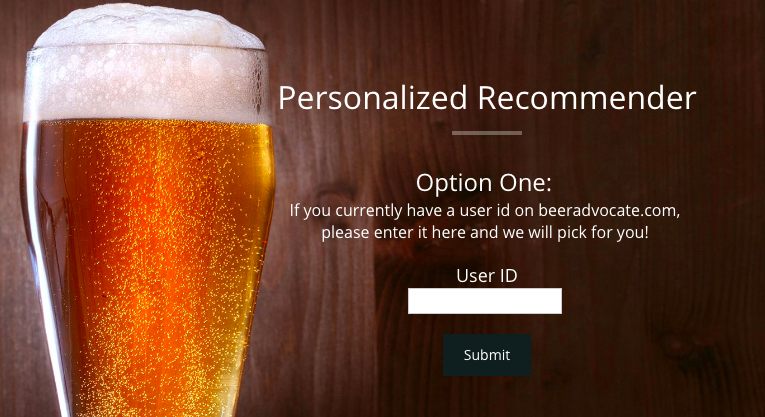
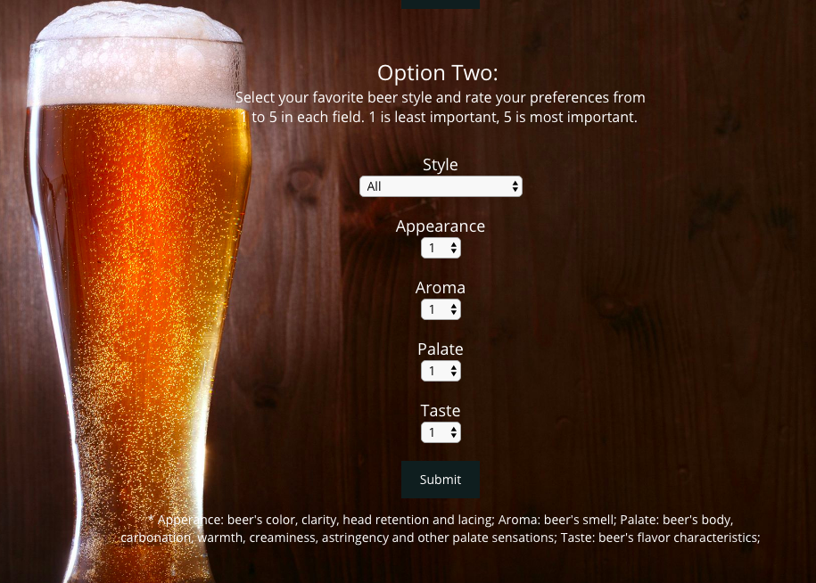
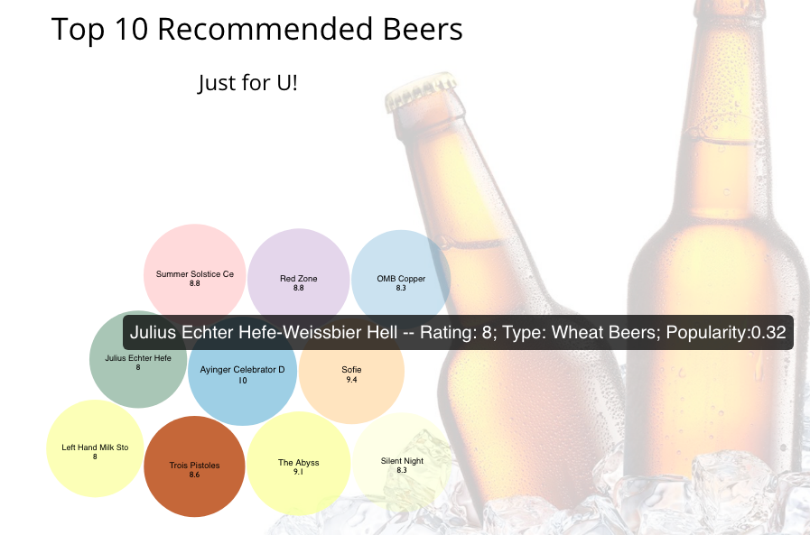
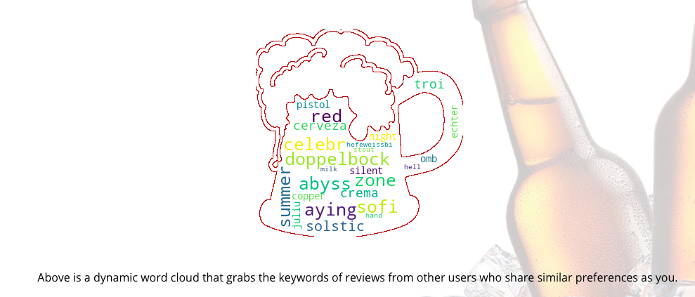

# Gimmebeer

Beer, as one of the oldest drinks humans have produced, dates back to 5000 BC. In 2017, the beer market generated US$281 billion revenue worldwide, with total beer consumption over 144 billion liters. There are over 300,000 different beers worldwide, and more than 150 different types are classified according to the Brewers Association. A comprehensive, innovative beer recommendation system would be valuable, especially to beer lovers.

## Overview

Two options are offered to users. With option one, if a user is a current user of BeerAdvocate.com and has provided reviews before, by entering their user ID, our application will produce a personalized recommendation list.


With option two, for non-current users of BeerAdvocate.com, they can select a beer style they prefer and rate their preferences among beer attributes including Appearance, Aroma, Palate, and Taste.


Our application will initially provide 10 recommended beers based on a user’s inputs. Each circle represents a recommended beer. Each color represents a style. The size of the circle and the number in each circle reflects the likelihood of a user enjoying the beer. The opacity of the circle reflects the popularity of the beer which is determined by the number of reviews on BeerAdvocate.com for each beer. According to our algorithm engine, larger circles and larger rating numbers indicate a higher chance that a certain beer will be enjoyed by this one user.


Together with the recommended beers, our recommender is also able to generate a unique word cloud, based on the reviews exclusively for the user’s 10 recommended beers. This word cloud provides characteristics of the 10 recommended beers by extracting the keywords from reviews for the same beers that are contributed from other users, as shown in following figure.



## Getting Started

Requirement:
- OS: Mac OS (Windows is not recommended as it requires virtual server. You can follow instructions in the link to setup python virtual enviornment in order to run Python Flask http://timmyreilly.azurewebsites.net/python-flask-windows-development-environment-setup/ )
- Software: Python3, Python Flask

Steps:
1. Download data folder from "https://drive.google.com/drive/folders/1IIiEtVAHG6Wu5GfjwBivjbJ_oWc5Is24?usp=sharing"
2. Unzip the file and put the data folder within App folder as follow
3. Structure:
```
    App
     --data
       --beer_counts.csv
       --beer.json
       --beeradvocate_tableformat.tsv
       --mapping.csv
       --user_pair.json
       --UserScoreTextStyle
         ...
       --UserWeight.tsv
     --static
       ...
     --templates
       --beer.html
       --recommend_by_attr.html
     --application.py
```
4. In terminal, within App folder, run python3 application.py
5. run http://127.0.0.1:5000/ in browser
6. exit server by CTL+c

## Authors

* **Chen, Yan-lin** - [Github](https://github.com/ylc0006)
* **Wu, Qiong**
* **Yu, Yang**
* **Jiang, Yinuo**
* **Wang, Zixin**
* **Guo, Zhijian**

## Acknowledgments

* Georgia Tech CSE6242 Data Visual Analytics
